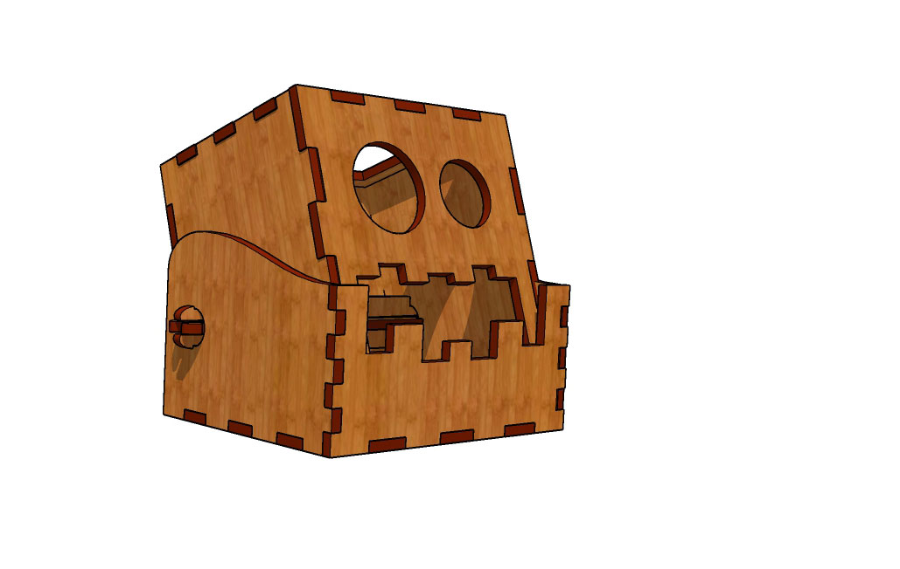

# HeadsUp x3

More information and additional images:  
https://obuqdesign.wordpress.com/2022/11/29/headsup-x3/

 

## Details

| Property | Value |
|---|---|
| Type | Three tridimensional models (10–11 pieces each) |
| Designed for | 3mm mdf or plywood |
| Design file format | DXF R14 |
| Units | mm |
| Scalable | No |

### Small
| Property | Value |
|---|---|
| Dimensions | Height: 30mm; Lenght: 30mm; Width: 38mm |
| Frame | 100x100mm |

### Medium
| Property | Value |
|---|---|
| Dimensions | Height: 63mm; Lenght: 55mm; Width: 65mm |
| Frame | 220x130mm |

### Big
| Property | Value |
|---|---|
| Dimensions | Height: 77mm; Lenght: 76mm; Width: 95mm |
| Frame | 300x250mm |

 

 

  If you like this design and would like to support my work:
    
  https://buymeacoffee.com/obuq

 

 

#### Thank you to all the patrons that supported me when this design was initially posted on Patreon

 

James Elkins  
Roman Kupalov  
F  
Chris Fontaine  
Rok  
patreon person  
Wouter Simons  
Bob-Bob Bob-Bob  
Peter Trzos  
Zak  
Julie Sturgeon  
Todd  
Rudenz Schulz  
Mehdi Vilchien  
Laura Culp  
Darkly Labs  
Aaron J Radke  
Renzo Ciarma  
Ray

